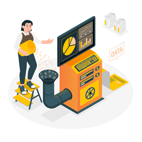

# **Data Engineering**

***

La ingeniería de datos es un conjunto de operaciones destinadas a crear interfaces y mecanismos para el flujo y acceso a la información.
  
   

# ¿Quiénes lo hacen?

Se necesitan especialistas dedicados (ingenieros de datos ) para mantener los datos de modo que permanezcan disponibles y utilizables por otros. 

# ¿Para qué?

Los ingenieros de datos configuran y operan la infraestructura de datos de la organización y la preparan para un análisis posterior por parte de analistas de datos y científicos. 

***

#  

1.	**Obtener** los conjuntos de datos necesarios para el planteamiento del problema
2.	**Desarrollar**, construir y mantener arquitecturas
3.	**Alinear** la arquitectura con los requisitos del negocio
4.	**Desarrollar** el proceso del conjunto de datos
5.	**Utilizar** lenguajes y herramientas de programación para ejecutar el conjunto de datos
6.	**Encontrar** el método para mejorar la fiabilidad y eficiencia de los datos
7.	**Utilizar** grandes conjuntos de datos para resolver problemas de la empresa
8.	**Importar** el aprendizaje automático y los métodos estadísticos
9.	**Realizar** los modelos de aprendizaje automático como predictivos y prescriptivos
10.	**Utilizar** los datos necesarios para preparar las tareas que se automatizarán
11.	**Entregar** los resultados a las partes interesadas basándose en los análisis realizados  

# ¿Por qué es importante?

La ingeniería de datos es importante porque permite a las empresas optimizar los datos hacia su usabilidad.

**Esto posibilita:**
- Encontrar las mejores prácticas para perfeccionar el ciclo de vida de desarrollo de software
- Reforzar la seguridad de la información y proteger la empresa de los ciberataques
- Aumentar la comprensión del conocimiento del dominio del negocio
- Reunir los datos en un solo lugar mediante herramientas de integración de datos

# 6 responsabilidades de un Data Engineer

**Entre las responsabilidades podemos enumerar:**

1.	Mover datos entre sistemas
2.	Administrar el data warehouse
3.	Construir y administrar data pipelines
4.	Disponibilizar los datos a los usuarios finales
5.	Llevar a cabo la estrategia de datos de la compañía
6.	Deploy de modelos ML a ambientes productivos

### ** 1) Mover datos entre sistemas**

Esta es la principal responsabilidad de un Data Engineer.

1.	**Extracción**: Extraer datos de múltiples fuentes como por ejemplo API’s externas, bases de datos, archivos planos, almacenamiento en la nube (S3, Azure Storage), etc.
2.	**Transformación**: Se trata de transformar los datos con el objetivo de filtrarlos, enriquecerlos, agregarlos, cambiar su estructura.
3.	**Carga**: En este paso los datos son cargados en la base final donde serán consumidos por otros sistemas. Esta base puede ser un data warehouse, almacenamiento en la nube, bases de datos en memoria, etc.

### ** 2) Administrar el data warehouse**

Cada vez más empresas están comenzando a utilizar data warehouses en su arquitectura de datos. Aquí las responsabilidades de los Data Engineers son:

- **Modelado del datawarehouse**: para modelar los datos de forma tal que las consultas analíticas demoren menos tiempo.
- **Performance del datawarehouse**: para asegurarse de que las consultas se ejecuten de forma rápida y garantizar que el warehouse pueda escalar sin sufrir un deterioro en la performance a medida que la cantidad de datos aumenta.
- **Calidad de los datos**: para asegurarse de que la calidad en los datos es la adecuada. 

### ** 3) Construir y administrar Data Pipelines**

Se trata de:

-	Mover datos entre sistemas, entre bases de datos, entre warehouses, etc

    1.	Transformar: los datos entre formatos, hacer agregaciones, etc.
    2.	Monitorear cañerías de datos
    3.	Administrar metadatos

Algunos programas utilizados con este fin son: Airflow, Prefect, Dagster, AWS Glue, AWS Lambda, Data Factory

  

### ** 4) Disponibilizar los datos a los usuarios finales**

Con los datos disponibles en el data warehouse, es tiempo de disponibilizarlos a los usuarios finales. Ellos pueden ser analistas, aplicaciones, clientes externos, etc. Dependiendo del usuario final se debe configurar:

1.	**Reporte/Dashboard**: Son plataformas utilizadas para analizar los datos de forma gráfica e intuitiva y algunas plataformas pueden ser: Tableau, Metabase, Superset, Power BI.
2.	**Permisos de acceso**: para una tabla hay que generar los permisos para el acceso de usuarios y aplicaciones.
3.	**Endpoints (APIs)**: algunas aplicaciones/clientes externos quizás necesiten acceso mediante una API para consultar la información.
4.	**Volcado de datos para clientes**: Algunos clientes quizás requieran extracciones específicas de información. En esos casos, el Data Engineer deberá generar los pipelines necesarios para disponibilizar esas extracciones.

### ** 5) Llevar a cabo la estrategia de datos de la compañía**

Esto incluye:

1.	Decidir qué datos recolectar, cómo recolectarlos y cómo guardarlos de forma segura
2.	Liderar la evolución de la arquitectura de datos para satisfacer nuevas necesidades de información
3.	Educar a los usuarios finales sobre cómo usar los datos de forma efectiva
4.	Decidir qué datos compartir con usuarios finales
 

### ** 6) Deploy de modelos ML a ambientes productivos**

Los científicos de datos construyen modelos que predicen de forma acertada el comportamiento de determinados procesos de negocio. El Data Engineer podrá optimizarlos para utilizarlos en un ambiente productivo.

