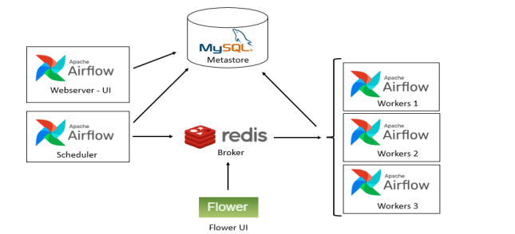

# ** Arquitectura en Airflow **

### **Ejecutores**

<b>Airflow</b> se compone de un servidor web que sirve la API, la interfaz de usuario y gestiona las peticiones y de un planificador (Scheduler) encargado de interpretar, ejecutar y monitorizar las tareas definidas en los DAGs. Este planificador contiene un ejecutor, encargado de lanzar los workers y repartir en ellos las tareas. 
<b>Airflow</b> también tiene una base de datos a modo de backend encargada de almacenar los metadatos, usuarios y ejecuciones. Por defecto usa Sqlite pero podemos usar otra base de datos en entornos de producción, como MySQL.
Existen varias formas de desplegar <b>Apache Airflow</b>, con múltiples arquitecturas para sus ejecutores: Local, Sequential, Celery, Dask, Mesos o <a href="https://aprenderbigdata.com/kubernetes/">Kubernetes</a>. También se puede usar con servicios en la <a href="https://aprenderbigdata.com/conceptos-basicos-de-la-nube/">nube de Azure</a>, <a href="https://aprenderbigdata.com/aws-conceptos-basicos/"> AWS</a> o Google Cloud. 

### Los más usados

<b>Single-Node Executors</b>: Los ejecutores de este tipo solo permiten la ejecución de tareas en un nodo o worker, que es el mismo host en el que se encuentra el Scheduler. No debemos considerar estos ejecutores para sistemas en producción ya que no son escalables y son puntos únicos de fallo.

<b>Sequential</b>: Este tipo de ejecutor secuencial se usa para debugging de DAGs y es compatible con SQLite a través de una única conexión de escritura. Ejecuta solo una tarea en cada instante.

<b>Local</b>: Ejecuta las tareas en paralelo. Es el entorno mínimo que se podría considerar para una aplicación real. También es compatible con SQLite

<b>Cluster Executors</b>: Para gestionar los recursos, Apache Airflow necesita una asignación fija de workers sobre los que distribuir la carga de trabajo.

<b>Celery</b>: Ejecuta tareas en paralelo en varios nodos separados, por lo que permite escalar el sistema de forma horizontal y vertical. Este tipo de ejecutor requiere desplegar un gestor de colas como puede ser <a href="https://aprenderbigdata.com/kafka-vs-rabbitmq/">RabbitMQ</a>. Además, se puede asignar cada tarea a una cola de procesamiento. En caso de fallo en algún worker podría desplegar uno nuevo.

<b>Dask</b>: Ejecuta cada una de las tareas en varios nodos dividiendo la carga de trabajo, por lo que puede conseguir un rendimiento mayor a Celery si se tiene en cuenta la localidad del dato (el trabajo ejecuta en el nodo que contenga el dato).

<b>Kubernetes</b>: Ejecuta cada tarea en un pod de Kubernetes, desplegando nuevos pods según la demanda de recursos. De esta forma, se consigue aprovechar los recursos de manera más eficiente.
