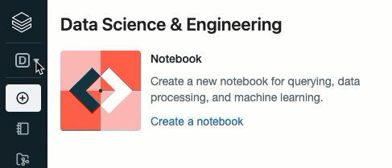

# **Conceptos**

***

Algunos conceptos son generales para Azure Databricks y otros son específicos del entorno de Azure Databricks basado en personas que estamos usando:

- 	Databricks Data Science & Engineering
-	Databricks Machine Learning
-	Databricks SQL

## **Workspaces**

En Azure Databricks, workspace tiene dos significados:

1.	Una implementación de Azure Databricks en la nube que funciona como el entorno unificado que se usa en el equipo Data para acceder a todos los activos de Databricks. 
2.	La interfaz de usuario para los entornos basados en personas Databricks Data Science & Engineering y Databricks Machine Learning. Esto es lo opuesto al entorno SQL de Databricks.

Cuando hablamos del " workspace browser", por ejemplo, nos referimos a la interfaz de usuario que le permite explorar notebooks, librerias y otros archivos en los entornos de Data Science & Engineering y Databricks Machine Learning, una interfaz de usuario que no forma parte del entorno de Databricks SQL. Aunque todos están incluidos en el workspace implementado de Azure Databricks. 

***
 

