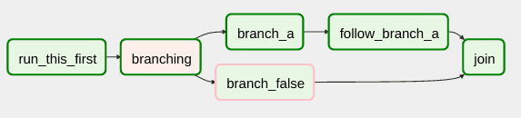

# **DAGs en Apache Airflow**

En <b>Airflow</b>, se trabaja con <b>DAGs (Directed Acyclic Graphs)</b>. Son colecciones de tareas o de trabajos a ejecutar conectados mediante relaciones y dependencias. Son la representación de los workflows.
Los grafos deben cumplir dos condiciones: ser dirigidos y acíclicos:
    23Q2
<ul>
<li> <b>Dirigidos</b>: Las relaciones entre los nodos tienen solo un sentido.</li>
<li> <b>Acíclicos</b>: No pueden formar ciclos, es decir, la ejecución no puede volver a un nodo que ya ha ejecutado.</li></ul>

Cada una de las tareas del DAG representada como un nodo, se describe con un operador y generalmente es atómica. Existen operadores predefinidos, y es posible extender y crear nuevos operadores si fueran necesarios.
Por ejemplo, <i>BashOperator</i> se encarga de ejecutar un comando Bash mientras que <i>PythonOperator</i> se encarga de ejecutar una función de <a href="https://aprenderbigdata.com/mejores-libros-python/">Python</a>.

*Ejemplo de flujo en Apache Airflow*

En este ejemplo, observamos que es posible definir ramas o <i>branches</i> en un grafo. En cada división del flujo solo ejecutan las tareas definidas en una de las ramas, dependiendo de una condición evaluada anteriormente. Al no ser posible definir una rama sin ninguna tarea, para representar ramas sin acciones se usan tareas vacías llamadas <i>dummy tasks</i>.
Por ejemplo, un <i>workflow</i> o pipeline sencillo podría contener las siguientes tareas: 
<ol>
<li><b>Descargar</b> datos de una base de datos MySQL</li>
<li><b>Enviar</b> los datos a un clúster de <a href="https://portal.azure.com/#home">Azure</a></li>
<li>Realizar <b>transformaciones</b> sobre los datos con <a href="https://adb-5427122988767958.18.azuredatabricks.net/login.html">Databricks</a></li>
<li><b>Generar</b> un mensaje de terminación</li>
</ol>
Entre los operadores más usados se encuentran los siguientes: 
<ul>
<li><b>Bash Operator</b>: Permite ejecutar scripts en Bash, aunque es posible modificarlo.</li>
<li><b>Database Operator</b>: Nos permite interactuar con bases de datos. Se usan al obtener datos de una base de datos mediante consultas SQL e información de autenticación. Es compatible con bases de datos populares como MySQL, Postgres, Sqlite o con JDBC.</li>
<li><b>Python Operator</b>: Ejecuta scripts en Python y operaciones creadas para el DAG.</li>
<li><b>Sensor Operator</b>: Está a la espera de detectar modificaciones en sistemas externos como ficheros o fuentes de datos.</li>
<li><b>Email Operator</b>: Este operador permite enviar un email a modo de notificación.</li>
<li><b>HTTP Operator</b>: Permite usar una API HTTP que necesite autenticación.</li>
</ul>

<b>La creación de DAGs se realiza a través de código</b> <a href="https://aprenderbigdata.com/cursos-python/">Python</a>. Realmente, el fichero python es un fichero de configuración que especifica la estructura del DAG con código. 
El propósito de este script es definir el objeto DAG por lo que debe evaluarse rápidamente y por tanto no es el lugar para realizar procesamiento de datos.
La interfaz gráfica permite monitorizar el estado de ejecución de las tareas, pero no permite crear nuevos flujos.

## **Características**

Cuando una tarea se ejecuta en <b>Airflow</b>, se denomina instancia, y tiene un tiempo asociado al momento de ejecución. Además, incorporan un atributo que describe su estado de ejecución: <b><i>Running, Failed, Success</i></b>, etc. La combinación de estas instancias de tareas genera un <i>workflow</i> o un flujo de trabajo. 
Para establecer los tiempos máximos de ejecución para cada tarea, <b>Airflow</b> trabaja con SLAs (Service Level Agreements). Cuando el SLA no se cumple para alguna tarea, se puede informar al usuario o administrador del sistema. 
Aunque las tareas de <b>Airflow</b> pueden intercambiar metadatos, no se deben encargar de mover datos entre ellas. 
Las tareas definidas en el script ejecutan en un contexto diferente en los ejecutores y en diferentes instantes de tiempo. Esto significa que no se puede usar el script para comunicación entre tareas. Aun así, es posible gestionar el paso de mensajes y compartir el estado entre las tareas que ejecutan. Para ello se usa <i>XCom</i> (Cross-communication) y también se pueden definir variables en formato clave-valor. 
<b>Airflow</b> también proporciona interfaces de comunicación llamadas <b><i>Hooks</i></b> para conectar con otras plataformas y bases de datos externas como pueden ser <a href="https://aprenderbigdata.com/hdfs/">HDFS</a> o <a href="https://aprenderbigdata.com/apache-hive/">Apache Hive</a>. Los conectores facilitan la creación de nuevas tareas independientemente del origen y del destino de los datos. 
Además, <b>Airflow</b> permite un control visual del estado de cada paso, <b>facilitando la trazabilidad y la localización de errores</b> conservando un histórico de fallos para detectar y prevenir problemas. Cuando una tarea falla, podemos configurar el sistema para que se reintente, o bien definir actuaciones en función del fallo que haya ocurrido.

