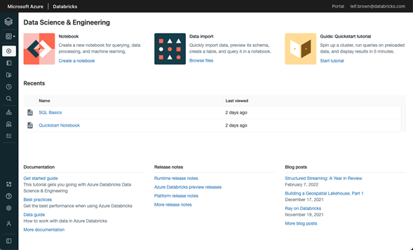

# **Databricks Data Science & Engineering**

***

Es el entorno clásico de Azure Databricks para la colaboración entre científicos de datos, ingenieros de datos y analistas de datos. 

## **Workspace**

Organiza los objetos (notebooks, libraries, dashboards, y experiments) en carpetas y proporciona acceso a los objetos de datos y los recursos de cálculo.

Objetos contenidos en las carpetas del workspace de Azure Databricks. 

- 	[Notebook](https://docs.microsoft.com/en-us/azure/databricks/notebooks/)
-	[Dashboard](https://docs.microsoft.com/en-us/azure/databricks/notebooks/dashboards)
-	[Library](https://docs.microsoft.com/en-us/azure/databricks/libraries/)
-	[Repo](https://docs.microsoft.com/en-us/azure/databricks/repos/)
-	[Experiment](https://docs.microsoft.com/en-us/azure/databricks/applications/mlflow/tracking#mlflow-experiments)

 

> 📝 **Nota:** Así se vería la interfaz en Databricks. 
>
>

 

## **Data management**

En esta sección se describen los objetos que contiene los datos sobre los que se realizan análisis y que alimentan los algoritmos de aprendizaje automático.

-	[Databricks File System (DBFS)](https://docs.microsoft.com/en-us/azure/databricks/data/databricks-file-system)
-	[Database](https://docs.microsoft.com/en-us/azure/databricks/data/tables)
-	[Table](https://docs.microsoft.com/en-us/azure/databricks/data/tables)
-	[Metastore](https://docs.microsoft.com/en-us/azure/databricks/data/metastores/)

## **Computation management**

En esta sección se describen los conceptos que debe conocer para ejecutar cálculos en Azure Databricks.

-	[Cluster](https://docs.microsoft.com/en-us/azure/databricks/clusters/)
-	[Pool](https://docs.microsoft.com/en-us/azure/databricks/clusters/instance-pools/)
-	[Databricks runtime](https://docs.microsoft.com/en-us/azure/databricks/runtime/#dbr-overview)
-	[Job](https://docs.microsoft.com/en-us/azure/databricks/jobs)
