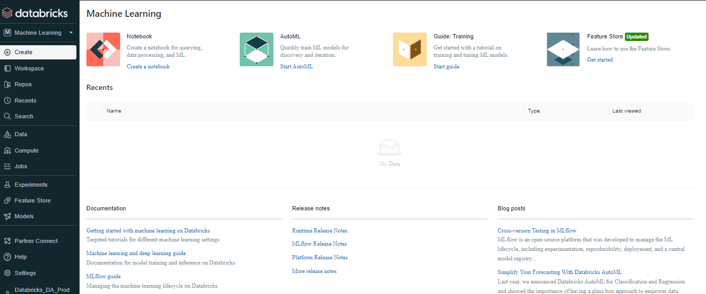

# **Databricks Machine Learning **

***

Un entorno de aprendizaje automático integrado de un extremo a otro que incorpora servicios administrados para el seguimiento de experimentos, entrenamientos de modelos, el desarrollo y la administración de features de modelos. 
  
  
 

> 📝 **Nota:** Así se vería la interfaz en Databricks. 
>
>

