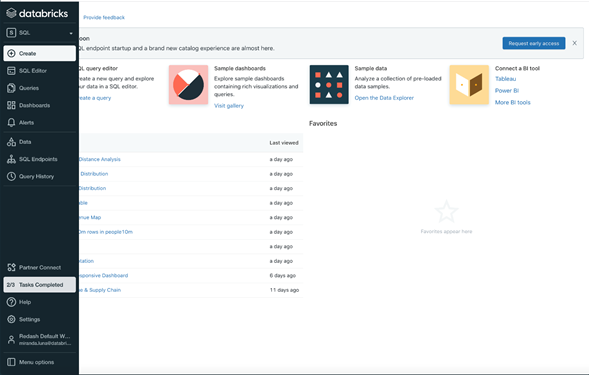

# **Databricks SQL**

***

Dirigido a analistas de datos que trabajan principalmente con consultas SQL y herramientas de BI. Proporciona un entorno intuitivo para ejecutar consultas ad-hoc y crear paneles sobre los datos almacenados en su lago de datos. 

 

> 📝 **Nota:** Así se vería la interfaz en Databricks. 
>
>

 

## **Data management**

-	[Visualization](https://docs.microsoft.com/en-us/azure/databricks/sql/user/visualizations/)
-	[Dashboard](https://docs.microsoft.com/en-us/azure/databricks/sql/user/dashboards/)
-	[Alert](https://docs.microsoft.com/en-us/azure/databricks/sql/user/alerts/)

## **Computation management**

-	[Query](https://docs.microsoft.com/en-us/azure/databricks/sql/user/queries/)
-	[ClusSQL endpointter](https://docs.microsoft.com/en-us/azure/databricks/sql/admin/sql-endpoints)
-	[Query history](https://docs.microsoft.com/en-us/azure/databricks/sql/admin/query-history)

