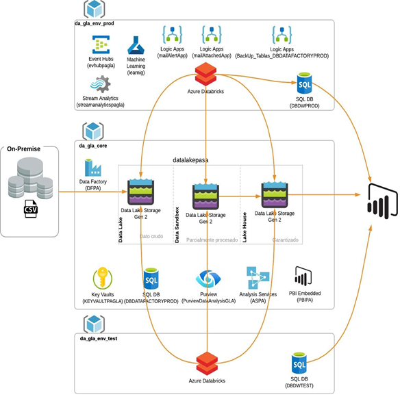

# **Arquitectura Data Analysis**

***  

 El objetivo del presente documento es ser una guía para el diseño de los tres tipos de arquitectura (data warehouse - data lake - data lakehouse), detallando una serie de estándares básicos de modelado para tener encuenta al momento de realizar una definición/especificación de una necesidad. Cualquier requerimiento o proyecto debe seguir los lineamientos generales que en este documento se exponen. 

 

