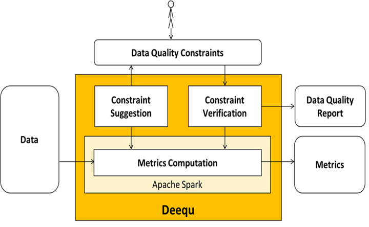

# ** Deequ **

***
## **¿Qué es ?**

Es un marco de código abierto para probar la calidad de los datos. Está diseñado para escalar a grandes conjuntos de datos. El sistema calcula las métricas de calidad de los datos con regularidad, verifica las restricciones definidas  y publica conjuntos de datos en caso de éxito. 
 

## **Nos Permite**

- Calcular métricas de calidad de datos en nuestro conjunto de datos
- Definir y verificar las limitaciones de calidad de los datos. 
- Especificar qué comprobaciones de restricciones se realizarán en sus datos.
- Sugerir las limitaciones de calidad de los datos en las tables/archivos de entrada
- Verificar las restricciones sugeridas antes mencionadas
- Calcular las métricas de calidad
- Ejecutar la elaboración de perfiles de columna

## **3 Componentes Importantes **

***

**Constraint Suggestion :** podemos definir nuestras propias restricciones de calidad de datos personalizadas o utilizar los métodos automatizados de sugerencia de restricción que perfilan los datos para inferir restricciones útiles.

**Constraint Verification :** como usuarios, nos enfocamos en definir un conjunto de restricciones de calidad de datos que se deben verificar. Deequ se encarga de derivar el conjunto requerido de métricas que se calcularán sobre los datos. 
Deequ genera un informe de calidad de datos, que contiene el resultado de la verificación de la restricción.

**Metrics Computation :** Deequ puede calcular métricas de calidad de datos con regularidad.

