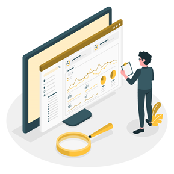
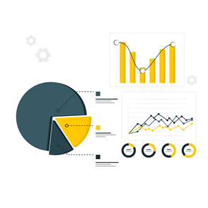
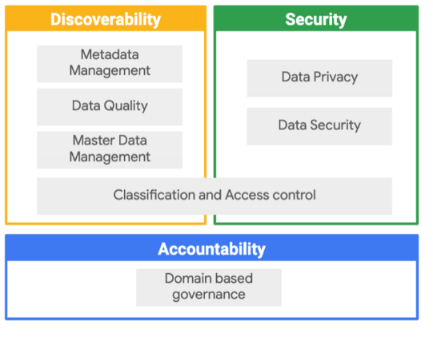
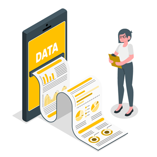

# **Data Governance**

***

Cuando hablamos de <b>Data Governance</b> nos referimos, ante todo, a una función de la gestión de datos para garantizar la calidad, integridad, seguridad y usabilidad de los datos recopilados por una organización y debe abarcar todo el ciclo de vida de estos.
Estas prácticas se configuran como estándares y son una intersección entre normas de privacidad y reglamentos internos de las empresas.

 

## **¿Qué garantiza el gobierno de datos?**

**Nos aseguramos de que los datos:**:

1. Sean correctos
2. Estén actualizados y sean coherentes
3. Sean seguros:

    - Solo los usuarios permitidos tengan acceso
    - Sea auditable (registro de accesos y cambios)
    - Se cumplan con regulaciones

 

## **¿Cuál es su propósito?**

El gobierno de datos tiene como principal finalidad mejorar la confianza en los datos. Que los datos sean confiables son una condición necesaria para emplear los datos en la toma de decisiones.

## **¿Qué aspectos son clave para la gobernanza de datos?**

1. **Discoverability**: metadata management, data quality, master data management
2. **Security**: data privacy, data security
3. **Accountability**: Domain based governance

## **¿Por qué la gobernanza de datos es cada vez más importante?**

Tradicionalmente el gobierno de datos se consideró solo como una función de TI, sin embargo, dada la envergadura de la revolución digital, el big data y las diferentes regulaciones introducidas en industrias, hacen del Data Governance un eje principal a la hora de gestionar la data adecuadamente.

 

## **¿Qué cambió?**

### **Los 7 eventos que nos obligan a implementar Data Governance:**

1.	Se generan muchísimos datos
2.	Aumento en la cantidad de personas que trabajan con datos
3.	Métodos de captura (data points) cada vez más avanzados
4.	Recolección de datos no estructurados
5.	Aumento de casos de uso en la gestión de datos
6.	Nuevas regulaciones y leyes
7.	Preocupación ética en el uso de datos

## **¿Y cuáles son las 10 principales acciones de implementación?**

1.	Diccionario empresarial: clases, políticas y casos de uso
2.	Clasificación de datos y organización
3.	Catalogación de datos y gestión de metadatos
4.	Calidad de datos
5.	Trazabilidad y linaje
6.	Privacidad y cifrado
7.	Persistencia y eliminación de datos
8.	Workflow de adquisición de datos
9.	IAM: administración de identidad y acceso
10.	Autorización de usuario y gestión de accesos

 

