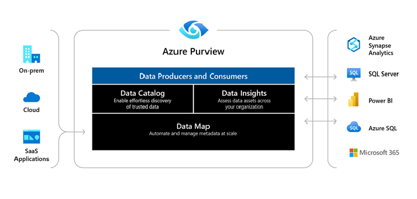

#     

 <b>Azure Purview</b> es un servicio de gobierno de datos unificado que nos ayuda a administrar y controlar sus datos locales, de varias nubes y de software como servicio (SaaS). Nos permite crear mapa holístico y actualizado de nuestro entorno de datos con descubrimiento de datos automatizado, clasificación de datos confidenciales y linaje de datos de extremo a extremo. 
Los consumidores de datos van a encontrar valiosos y confiables. 
 
Arquitectura de alto nivel de Azure Purview, que muestra fuentes locales y múltiples nubes que fluyen hacia Azure Purview, y las aplicaciones de Azure Purview (Data Catalog, Map e Insights) que permiten a los consumidores y curadores de datos ver y administrar metadatos. Estos metadatos también se extenderán a servicios de análisis externos de Azure Purview para su procesamiento posterior. 
 

   

<table>
<thead>
  <tr>
    <th>App</th>
    <th>Descripción </th>
  </tr>
</thead>
<tbody>
  <tr>
    <td><a href="https://docs.microsoft.com/en-us/azure/purview/overview#data-map" target="_blank" rel="noopener noreferrer">Data Map</a></td>
    <td>Hace que los datos sean significativos al graficar los activos de datos y sus  relaciones en todo nuestro patrimonio de datos. El mapa de datos utilizado  para descubrir datos y administrar   el acceso a esos datos.   </td>
  </tr>
  <tr>
    <td><a href="https://docs.microsoft.com/en-us/azure/purview/overview#data-catalog" target="_blank" rel="noopener noreferrer">Data Catalog</a> </td>
    <td>Encuentra fuentes de datos confiables navegando y buscando activos de datos. El catálogo de datos   alinea activos con términos comerciales amigables  y clasificación de datos para identificar fuentes de datos.   </td>
  </tr>
  <tr>
    <td><a href="https://docs.microsoft.com/en-us/azure/purview/overview#data-insights" target="_blank" rel="noopener noreferrer">Data Insights</a> </td>
    <td>Brinda una descripción general de suestado de datos para ayudar a descubrir qué tipo de datos tiene y dónde.   </td>
  </tr>
</tbody>
</table>

***

## **Ventajas de Azure Purview**

 <b>Azure Purview</b> nos ayuda a obtener el máximo valor de nuestros activos de información existentes. El catálogo hace que las fuentes de datos sean fácilmente detectables y comprensibles para los usuarios que gestionan los datos. 
 
Azure Purview proporciona un servicio basado en la nube en el que puede registrar fuentes de datos. Durante el registro, los datos permanecen en su ubicación actual, pero se agrega una copia de sus metadatos a Azure Purview, junto con una referencia a la ubicación del origen de datos. Los metadatos también se indexan para que cada fuente de datos sea fácilmente detectable a través de la búsqueda y comprensible para los usuarios que la descubren.
Después de registrar una fuente de datos, podemos enriquecer los metadatos. El usuario que registró la fuente de datos u otro usuario de la empresa agrega los metadatos. Cualquier usuario puede anotar una fuente de datos proporcionando descripciones, etiquetas u otros metadatos para solicitar acceso a la fuente de datos. Estos metadatos descriptivos complementan los metadatos estructurales, como nombres de columnas y tipos de datos, que se registran desde el origen de datos. 
 
Descubrir y comprender las fuentes de datos y su uso es nuestro objetivo principal del registro de las fuentes. Los usuarios empresariales pueden necesitar datos para inteligencia comercial, desarrollo de aplicaciones, ciencia de datos o cualquier otra tarea en la que se requieran los datos correctos. Usan la experiencia de descubrimiento del catálogo de datos para encontrar rápidamente datos que se ajusten a sus necesidades, comprender los datos para evaluar su idoneidad para el propósito y consumir los datos abriendo la fuente de datos en la herramienta de su elección. 
 
Al mismo tiempo, los usuarios pueden contribuir al catálogo etiquetando, documentando y anotando fuentes de datos que ya se han registrado. También pueden registrar nuevas fuentes de datos, que luego son descubiertas, comprendidas y consumidas por la comunidad de usuarios del catálogo.

